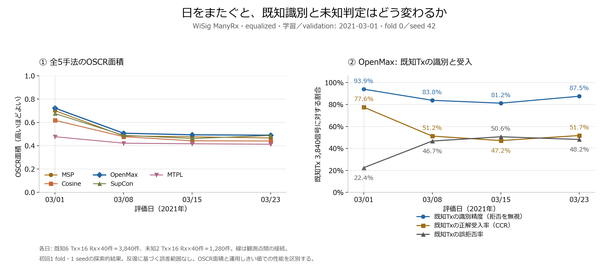

generated by AI(2026-10-06)

- [ ] レビュー済み

# 日跨ぎ改善の先行研究と実験仮説

- 調査・実験日: 2026-10-06。fold 0・seed 42の探索実験を実施。[短報](実験結果/短報.md)に数値とグラフを記録。
- 第一案: **学習する信号の総数を固定し、1日・2日・3日の学習を比較する**。
- 「日固有の特徴を学習した」は有力な仮説。「送信機固有の特徴がない」は現時点では断定できない。

## 1. 今回の結果から言えること

- 根拠: [初回比較結果JSON](../2.define-baseline-model/2026-10-06_初回比較結果.json)。fold 0・seed 42のみ、学習・validationは03/01。
- 条件: WiSig ManyRx、equalized、信号単位RMS正規化、同じ16 Rx、既知6 Tx・評価用未知2 Tx。詳細は[データ仕様](../2.define-baseline-model/00_common/docs/データ仕様と評価条件.md)を参照。

| OpenMaxの指標 | 03/01・同日 | 03/08 | 03/15 | 03/23 |
|---|---:|---:|---:|---:|
| 既知Txの識別精度・拒否を無視 | 93.9% | 83.8% | 81.2% | 87.5% |
| 既知Txの正解受入率・CCR | 77.6% | 51.2% | 47.2% | 51.7% |
| 既知Txの誤拒否率 | 22.4% | 46.7% | 50.6% | 48.2% |
| 未知Txの誤受入率・FAR | 47.7% | 46.8% | 42.3% | 52.1% |
| 既知・未知のAUROC | 0.7300 | 0.5458 | 0.5383 | 0.5043 |
| OSCR面積 | 0.7236 | 0.5079 | 0.4942 | 0.4910 |

- 上の率は既知または未知それぞれを分母とする。各日の既知3,840信号、未知1,280信号。
- 別日でも既知6クラスの識別精度は81〜87%。識別に使える情報が残ることを示すが、送信機の物理的指紋だけを捉えた証明ではない。
- AUROCは別日で0.5付近へ低下。既知・未知のスコア分離が弱まり、既知の誤拒否も増えている。
- 仮説: 分類特徴の変化に加え、03/01に校正したOpenMaxのクラス中心・裾分布が別日の既知信号に合わなくなった可能性がある。分布の図示で確認する。
- AUROCも落ちているため、しきい値を変えるだけで分離能力そのものが回復するとは限らない。同日の未知FARも高く、未知判定の課題は日跨ぎ前からある。
- OSCRは識別と未知拒否を合わせた面積。今回の符号付きOpenMaxスコアの面積には運用で許容しない受入領域も含むため、CCR・FARも併記する。[実装の定義](../2.define-baseline-model/手法の実装と再現手順.md)

## 2. 「日ごとの癖」の候補

- 通信路: 反射・遮蔽・周囲の物体などが変わり、同じTx・Rxでも波形が変化する。[1]
- 送受信機の状態: 電源の入れ直しでも識別性能が変わる実験報告がある。単なる通信路変化だけでは説明しきれない。[2]
- 前処理で残る成分: WiSigのequalizedは周波数ずれを補償して等化した後、周波数ずれを再付与する。equalized＝すべての受信条件差を除去した信号、とは扱わない。[1, §IV-B]
- 校正の変化: 今回のOpenMaxはCNNの6次元logitsにクラス中心・Weibull分布をfitする。日ごとのlogits変化が拒否に影響する可能性は、今回の実装から立てた仮説。
- WiSig compactには電源状態・温度・元パケット時刻がない。原因の因果的な切り分けには追加計測が必要。日付は複数の条件変化をまとめたラベルと捉える。

## 3. 優先して読む先行研究

- [1]〜[5]は公開本文の該当節を確認。[6]は出版社の検索取得本文、[7]は出版社の要旨・公開抜粋を確認。全手法を再現・検証した調査ではない。

| 文献・確認箇所 | 得られる示唆 | 今回との差・使い方 |
|---|---|---|
| **[1] Hanna・Karunaratne・Cabric, WiSig**, IEEE Access, 2022。[本文](https://arxiv.org/pdf/2112.15363)、§VI-B・Fig. 11、§IV-B。DOI: 10.1109/ACCESS.2022.3154790 | 1・2・3日で学習し、残した最終日を評価。複数日学習と等化で別日の分類性能低下を抑える。 | 複数日案の直接の根拠。ManySigの単一Rx・既知分類の実験であり、今回のManyRx・open-set改善を保証しない。 |
| **[2] Alhazbi・Sciancalepore・Oligeri, The Day-After-Tomorrow: On the Performance of Radio Fingerprinting over Time**, ACSAC 2023。[本文](https://arxiv.org/html/2305.05285v2)、§5.2〜5.4。DOI: 10.1145/3627106.3627192 | 有線でも電源の入れ直しで低下。I/Q分布の画像化・平均化による緩和を検討。 | 「通信路だけが原因」という説明を見直す材料。BPSK・長いI/Q区間を用いるため、256点Wi-Fiプレアンブルへそのまま移せない。 |
| **[3] Chen・Wong・Hamdaoui, Unsupervised Contrastive Learning for Robust RF Device Fingerprinting Under Time-Domain Shift**, ICC 2024。[本文](https://arxiv.org/html/2403.04036v1)、§II-B/C。arXiv:2403.04036 | 別日の信号を使った対照事前学習で日跨ぎの分類を改善する。 | **sourceとtarget両方のラベルなしデータを事前学習に使用**する適応設定。同じ送信区間から作る正例には区間の対応情報が必要。今回の「後日データを学習に使わない」評価とは別条件。 |
| **[4] Shen・Zhang・Marshall・Cavallaro, Towards Scalable and Channel-Robust Radio Frequency Fingerprint Identification for LoRa**, IEEE TIFS 2022。[著者版](https://livrepository.liverpool.ac.uk/3148161/1/TIFS2022_LoRa_RFFI.pdf)、§IV・V-A・VII-E。DOI: 10.1109/TIFS.2022.3152404 | 通信路の影響を抑える表現、triplet学習、多重反射・Dopplerを含む拡張を組み合わせる。 | LoRa用の表現と長い入力が前提。Wi-Fiでは拡張の考え方を参考にし、変換の妥当性を個別に確認する。拡張だけで成功するとの報告ではない。 |
| **[5] Ying Zhangほか, Domain Generalization for Cross-Receiver Radio Frequency Fingerprint Identification**, 2024公開版。[本文](https://arxiv.org/html/2411.03636v1)、§III-B・V。arXiv:2411.03636 | RIEIは送信機成分と受信機成分を分け、未知の受信機へ汎化させる。WiSigの256点I/Qでも評価。 | 主題は受信機変更・既知分類。受信機ラベルを日付へ置き換える案は本調査からの発展仮説であり、原論文の日跨ぎopen-set実証ではない。 |
| **[6] Yuheng Yangほか, Source-Free Class-Balanced Pseudo-Label Adaptation for Large-Scale Cross-Day WiFi Transmitter Identification**, Sensors, **2026-09-21**。[出版社](https://www.mdpi.com/1424-8220/26/18/5975)、要旨・§1。DOI: 10.3390/s26185975 | 学習済みモデルとラベルなし後日データで、BN統計・疑似ラベルを調整。後日の適応用信号とtestは分離。 | WiSig ManyTx・140 Tx・固定1 Rx・closed-set。未知Txを既知に割り当てる危険があるため、今回の主実験へ直接混ぜない。source-freeはtargetを使わない、という意味ではない。 |
| **[7] Beyond correlation: causal learning for open-set single-source RF fingerprinting in dynamic IoT**, Internet of Things, **2026-07**。[出版社](https://www.sciencedirect.com/science/article/pii/S2542660526001071)、要旨・公開抜粋。DOI: 10.1016/j.iot.2026.101977 | 単一sourceから未知環境への汎化と未知送信機拒否を組み合わせるCRL-SEIを提案。 | 問題設定が近い関連研究。本文の詳細条件・コードは未確認。新規性を判断する前に入手して比較する。 |

- 読む順序: [1] Fig. 11 → [2] 原因分析 → [3] target使用条件 → [5] 特徴分離。[4]は拡張案、[6][7]は最近の関連研究として確認。
- 複数日を足すこと自体は既存手法。研究上の差は、**同じ信号数で日数を変えたときのopen-set性能と、特徴学習・校正それぞれの寄与**をどこまで説明できるかに置く。独自性の確定には追加調査が必要。

## 4. 学生として試す仮説

| 優先 | 仮説 | 小さな実験 | 支持される観測・限界 |
|---|---|---|---|
| 1・H1 | 1日の条件への依存が強い。複数日の学習で未知日の変動に耐えられる。 | 同じCNN＋OpenMaxで学習日数を1→2→3へ。総信号数固定の比較を主にする。 | 未使用日のOSCR・AUROC・CCRが改善し、FARが悪化しない。日数・日付組合せの効果を確認する。改善だけで物理的指紋の抽出を証明しない。 |
| 2・H2 | CNNの識別に加え、OpenMaxの校正が特定日に依存する。 | CNNを固定し、クラス中心・裾のfitに使う既知信号を単日／複数日で比較。fitの総数をクラスごとにそろえる。 | 既知識別精度の大きな変化なしにCCR・FAR・AUROCが改善すれば、校正の寄与を支持。fit用とvalidationは別信号にする。 |
| 3・H3 | 同じTxの別日信号を近づける制約が必要。 | 複数日CE学習と、同じ総数・encoderでCE＋SupConを比較。同一Tx・異なる日の正例をbatch内に入れる。 | 単なる複数日CEより未知日が改善する。既存の単日SupConとは別仮説。推論を同じOpenMaxにそろえ、lossと未知判定方式の変更を混同しない。 |
| 4・H4 | 学習日で見なかった位相・雑音等への感度が高い。 | CE基準に位相回転、AWGNを1種類ずつ追加。弱い拡張から始め、後で組み合わせる。 | 未使用日の改善と同日の識別を両方確認。強いCFO・I/Q不平衡補償はTxの特徴も消し得るため初手にしない。 |
| 5・H5 | 日の情報が特徴へ強く残る。明示的な分離が必要。 | training日のラベルを予測する補助headと、gradient reversalで日を見分けにくくする学習を検討。 | 日予測の低下とTx識別・open-set性能の維持を両方確認。[5]からの応用案。日予測が難しいだけでは未知日汎化の証明にならない。 |

- H1→H2を最初の組にする。改善不足ならH3、その後H4/H5へ進む。
- RMS正規化後の単純な正のgain拡張は再正規化でほぼ相殺される。拡張は「何の変化を再現するか」を説明できるものを選ぶ。
- equalized／unprocessed比較も診断候補。ただし両表現の同じ添字が同じパケットとは保証されない。条件・件数をそろえた集計比較とし、対応のある比較とは呼ばない。

## 5. 初回実験と次の条件

- 後日データを学習に使わず未知日へ対応する設定を主実験にする。後日のラベルなしデータを使う適応実験は別枠として記録する。
- 初回は2021-03-23を評価日とする計画に沿って、A1〜A3と固定CNNのH2比較を実行。信号分割・件数・結果は[短報](実験結果/短報.md)と[条件JSON](実験結果/実験条件.json)に記録。

| 条件 | 学習日 | 既知1 Tx×Rxあたりの学習数 | 学習総数・6 Tx×16 Rx |
|---|---|---:|---:|
| A1 | 03/01 | 120 | 11,520 |
| A2 | 03/01・03/08 | 各日60 | 11,520 |
| A3 | 03/01・03/08・03/15 | 各日40 | 11,520 |
| 単日対照 | 03/08のみ、03/15のみ | 各条件120 | 各条件11,520 |

- 未実施の03/08単日・03/15単日対照で「複数日の多様性」と「testに近い日を使う効果」を切り分ける。日付条件はtest結果を見て選ばない。
- 学習総数増加の参考実験は各日120件にする。2日23,040件、3日34,560件。総数固定の結果と分け、更新回数・実行時間も記録する。
- 共通: 初回は同じ16 Rx・Tx役割・encoder・学習信号総数・校正候補で比較。source日ごとに評価用信号を先に除き、学習・validation・評価日の信号が重ならない分割にした。early stoppingの実更新回数も保存。
- validationはsource日から1 Tx×Rxあたり**合計40件**を均等配分する。3日は13/13/14件とし、余りの配分を事前固定。既知と調整用未知の両方に適用し、学習・校正fit・testと重複させない。
- 各日の参考test40件を先に予約し、残りからtraining／validationを選ぶ。校正fitは正しく識別した既知trainingが基本。H2の比較だけ別途同数のfit集合を定義する。
- CNNの選択は既知validation、OpenMaxの候補・しきい値は既知＋調整用未知validationで決める。評価用未知Txは全日のtraining／validation／fitから除外する。
- A1〜A3は特徴学習と校正の両方が変わる一連の処理の比較。H2の固定CNN比較で校正の寄与を切り分ける。
- 次はseed 43/44と全5 foldへ広げ、日・Tx・Rx別の件数と結果を残す。03/23の初回値は探索用であり、独立な確認ではない。
- 補助評価: 1日を丸ごと外し残る3日で学習する評価を4日分行う。未来日を使う場合もあるため、過去から未来への評価とは区別する。
- 03/23は初回比較で既に見ている。今後の学習には入れなくても、未閲覧の最終testとは呼べない。本データ内の探索的検証とし、主張の確認には新たな収録日・別データが望ましい。
- 複数日用の分割と実験コードは[実行スクリプト](scripts/run_multiday_experiment.py)として追加。元のベースライン設定・出力は維持。

## 6. 原因の図示と教授へ持っていく材料

- 図示: ①既存の全5手法OSCR、②OpenMaxの識別精度／CCR／誤拒否率、③既知・未知スコアのヒストグラム、④Txごとのlogits中心・距離の変化。
- ①②は添付図に作成済み。③④は信号別予測・logitsから作る次の診断。現行OpenMaxのfit対象はlogitsであり、128次元encoder特徴とは区別する。
- 特徴可視化を追加するならPCAをtrainingだけでfitし、validation・testを同じ変換へ投影する。t-SNE等の見た目だけで「指紋が消えた」と判断しない。
- 相談用の問い: 「同じ学習総数で日数を増やしたところ、識別と未知拒否はそれぞれどう変わったか。変化を通信路・無線機状態・校正のどれで説明できるか」。
- 持参物: [1] Fig. 11、[2] 原因分析、上記の結果図、H1/H2の比較表、改善しなかった条件も含む実験記録。
- 論文候補の問い: **複数日学習は未知日での既知誤拒否を、未知誤受入を増やさず減らせるか。その改善は特徴学習と校正のどちらから来るか。**
