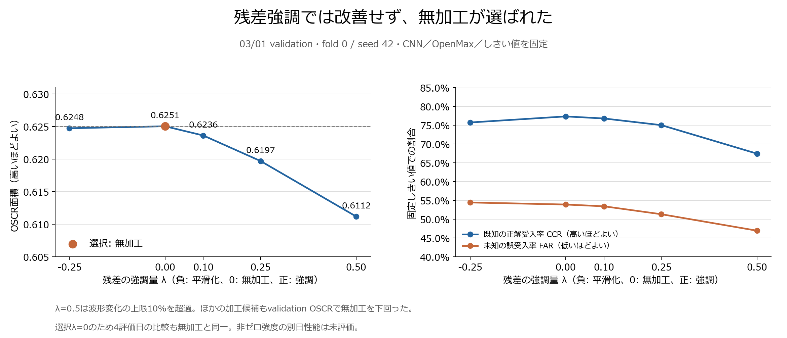

generated by AI(2026-10-07)

- [ ] レビュー済み

# 残差強調の初回結果

- **結論: 今回の残差強調は採用しない。validationでは全加工候補が無加工のOSCRを下回った。**
- 事前に決めた選択規則でλ=0、つまり無加工が選ばれた。選択後の4評価日も無加工と完全一致し、改善はなかった。
- **非ゼロ強度を別日のtestへ適用した結果ではない。** 別日に加工が効かないとまでは結論しない。
- 対象: WiSig ManyRx・equalized、fold 0・seed 42。既知6 Tx・調整用未知2 Tx・評価用未知2 Tx、同じ16 Rx・同じ信号番号。
- CNN重み・OpenMax校正・しきい値0.9886126942を固定。再学習・再校正なし。03/01のvalidationだけで強度を選び、選択を保存した後にtestを読んだ。

## 強度の選択結果

- validationは既知3,840信号＋調整用未知1,280信号。正のλは残差強調、負のλは平滑化、0は無加工。
- 既知分類はOpenMaxの拒否前予測の正解率。CCRは既知を正しく分類して受理する率、FARは未知を誤って受理する率。

| λ | validation OSCR | 無加工との差 | 既知分類 | CCR | 未知FAR | 相対波形変化の最大値 | 選択制約 |
|---:|---:|---:|---:|---:|---:|---:|---|
| 0 | 0.625062 | 0 | 94.24% | 77.34% | 53.91% | 0% | 適合・選択 |
| −0.25 | 0.624756 | −0.000306 | 93.98% | 75.73% | 54.45% | 7.28% | 適合 |
| 0.10 | 0.623644 | −0.001418 | 94.24% | 76.80% | 53.44% | 2.59% | 適合 |
| 0.25 | 0.619716 | −0.005347 | 94.04% | 75.03% | 51.33% | 6.20% | 適合 |
| 0.50 | 0.611189 | −0.013874 | 93.88% | 67.45% | 46.95% | 11.73% | 波形変化10%の上限を超過 |

- λ=0.5は制約外だが、制約内のλ=0.1／0.25もOSCRが低かった。制約だけが採用を妨げたわけではない。
- 強い残差強調で未知FARは下がったが、既知CCRも下がった。未知を拒否しやすくする利益と、既知を誤拒否する損失が同時に生じた。
- λ=0.25のbalanced open-set accuracyは0.618490で無加工の0.617188より僅かに高いが、事前に固定した選択指標はOSCR。結果を見て指標を変更しない。

## 選択後の評価

| 評価日 | 無加工OSCR | 選択条件のOSCR・λ=0 | 差 |
|---|---:|---:|---:|
| 03/01 | 0.723615 | 0.723615 | 0 |
| 03/08 | 0.507899 | 0.507899 | 0 |
| 03/15 | 0.494157 | 0.494157 | 0 |
| 03/23 | 0.490964 | 0.490964 | 0 |

- 保存済みベースラインを全日で再現した。λ=0のため、logits・埋込み・スコア・確率・予測・ラベルも配列単位で一致した。
- 全評価日は過去に確認済みの探索用。最終的な未使用データによる検証ではない。

## 悪化の理由を調べた結果

- 以下は同じvalidation信号の事後分析。加工の選択には追加利用していない。

| 診断値 | 無加工 | λ=0.25 | λ=0.5 |
|---|---:|---:|---:|
| CNNのlogits最大値による既知分類 | 94.35% | 94.22% | 94.09% |
| 既知logitsから元の正解クラス中心までのeucos距離・中央値 | 0.03124 | 0.03375 | 0.04188 |
| 既知に割り当てた未知確率・平均 | 0.04037 | 0.04332 | 0.05026 |
| 埋込みのTx間距離²／Tx内ばらつき | 8.462 | 8.143 | 7.710 |

- 観測: CNNの既知分類は大きく崩れていない一方、元のOpenMax中心からの距離と既知の未知確率が増え、CCRが下がった。埋込みのTx間／Tx内比も改善しなかった。
- 解釈: 「Txの違いが明瞭になった」よりも、「入力加工で固定モデル・校正に対する特徴分布がずれた」という説明と整合する。ただし再校正対照を実施しておらず、校正だけが原因とは断定しない。
- 雑音・伝送路成分を増幅した可能性は残るが、この実験では成分を分離していない。雑音増幅や過学習が原因と確定したわけではない。
- 残差強調は自然なTx指紋だけを抽出する方法ではない。今回の条件では、指紋を強めれば改善するという仮説を支持しなかった。

## 保存物と次段階

- [結果JSON](残差強調の初回結果.json): 全候補、全評価日、特徴診断、元ファイルのSHA-256。
- [比較図PNG](残差強調の初回比較.png)・[SVG](残差強調の初回比較.svg)。集計スクリプト: [summarize_residual.py](../scripts/summarize_residual.py)。
- 生の実行記録・信号番号・全候補の配列: `../output/20261007_residual_fold00_seed42/`。Git対象外。
- 次は既知trainingで共通FIRを学習するM2。再校正B2は同じ加工強度と無加工の再校正対照を置き、入力加工の効果と分ける。[研究計画](../../研究計画.md)
- 単一fold・seedの探索結果。一般的な有意差、最適強度、他の加工法の可否は判定していない。
